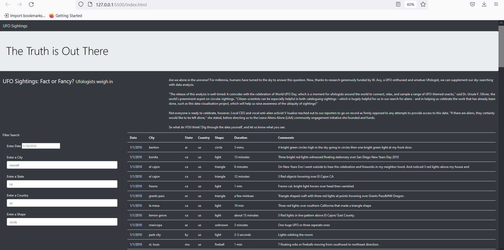
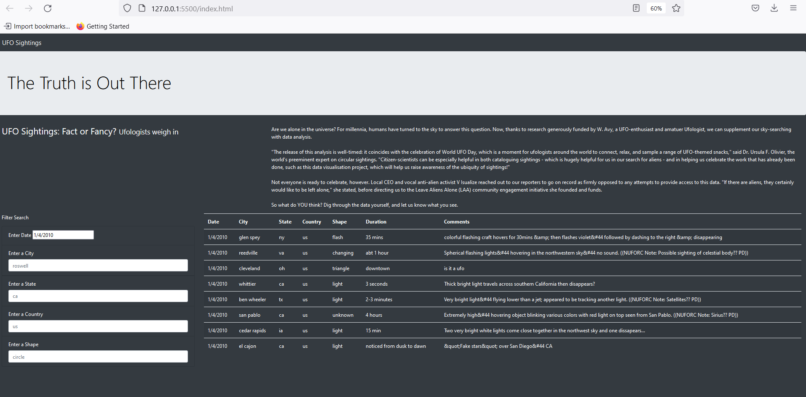
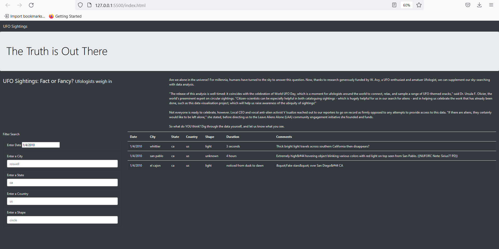

# UFOs Reports with Javascript and HTML: Analyzing UFO Sightings with Filters

## Overview of Project

### Purpose
The purpose of this webpage is to allow users to obtain in-depth analysis of UFO sightings where the users can select filter of multiple criteria including date, city, state of United States or Canada by two letter abbreviations, country by two letter abbreviations, and shape of the sighting. There are a total of 111 sightings in the dataset. The dates are from 1/1/2010 to 1/13/2010. There are 102 cities, 34 states, and 2 countries which are Canada and the United States. Also included in the dataset is duration of the sighting and comments regarding the incident which cannot be selected for.

## Results

### Project Analysis

The above image displays the webpage and its capabilities. The text above gives a general explanation of the purpose of the webpage. Below the explanatory paragraph is the data on UFO sightings.

A user can also perform a search by going to the search bar of each criterion and entering in a date as per the format of month, day, and year for the "Enter Date" portion and a string for the other four search bars corresponding to what is being requested that being city, state, country, and shape. 

The date must be in the "mm-dd-yyyy" American date format. The input for state and country has to be in the form of the two-letter abbreviation. All string inputs must be in lower-case. If these rules are not followed for use then the filter will return no data.

The user can filter for one criteria or multiple criteria depending on their preferences and then either hit the enter bar or click on "Filter Search" to filter the data for the selected criteria. Afterwards, only the portion of the data meets the selected criteria will be displayed.

An example is shown below where the date "1/4/2010" is selected for.

And here, an example is shown below where the date "1/4/2010" and the state "ca" is selected for.

## Summary

### Drawbacks

Two drawbacks of the page include limitation of the dataset to a very specific period of time and only two countries and the requirement to select the criteria to filter as per very specific formats. By the requirement to select the criteria to filter as per very specific formats, what this means is that the users cannot select with different time formats such as day, month, year or with the written form of January 1st, 2010. Likewise, the selections for state and country must follow the two letter abbreviations so the user cannot select by writing out the name such as "Canada", and the inputs for city, state, and country are case-sensitive for lower-case so no capitalization is allowed for use of filter.

Recommendations for improvement include expanding the dataset to include more dates and more countries. Additionally, development should allow for selection of date based on the European date format as well as for written out date formats for the United States and Europe. Another recommendation includes being able to filter for the state and country whether or not it is abbreviated or not and for the user to be able to select for the filter criteria regardless of the case.
